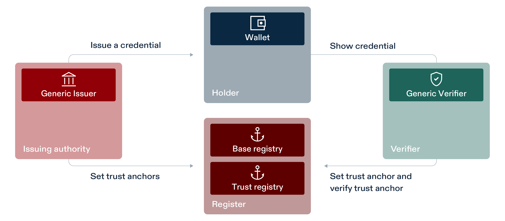

# Public Beta context

For a basic introduction to the Public Beta please consult the factsheet on eid.admin.ch: [Factsheet on eid.admin.ch](https://backend.eid.admin.ch/fileservice/sdweb-docs-prod-eidch-files/files/2024/10/24/fdbcf1fa-7f33-4f27-80d6-44f14d991939.pdf)

Following the successful milestone of the eLFA project, our next major step towards the Swiss e-ID and its trust infrastructure is the **Public Beta** phase, launching in Q1 2025. Public Beta will allow ecosystem participants to integrate and experiment with their business cases, including using a Beta ID credential.

The Public Beta environment is designed to test and refine the e-ID technology stack. Participants will be able to explore and experiment with various use cases, including:

- **Base Registry**: Entities can onboard, update, or offboard as issuers and verifiers within the ecosystem. The base registry will manage the public keys as part of the diddoc required for ecosystem interactions. Status lists containing information related to credential validity can be managed. 

- **Trust Registry**: Entities can prove and maintain their status as verified issuers or verifiers, ensuring additional trust within the ecosystem. Users will be able to see the verification status of issuers and verifiers in their wallets and verifiers are able to validate the trust-status of the issuers.

- **Issuers**: Entities can issue, revoke, suspend, and reactivate Verifiable Credentials (VCs), using the generic reference issuer implementation provided by the federal government. Please ensure to follow the specifications.

- **Verifiers**: Entities can integrate the reference verifier implementation to verify VCs, ensuring cryptographic integrity and validity according to their specific needs.

- **Holders**: Users will be able to download the public beta wallet, request Beta-ID credentials for testing purpose, manage their VCs and interact with the ecosystem.

## Development Process

- **Community Development**: Core libraries and shared components are developed openly with the community, with ongoing updates.

- **Internal Development**: Specific apps, registries, and components are developed privately and released publicly upon completion, so daily updates may not always be visible.

Public Beta is a critical milestone on the path to the final e-ID and its trust infrastructure, laying the groundwork for the productive environments that will follow.

# How to use the Public Beta

The onboarding process for the base- and trust-registry will be published as soon as possible.

# Specification

We integrate various technologies in the swiss infrastructure. You can view the supported specifications and the integrated versions in the following repository: 

Swiss Profile https://github.com/e-id-admin/open-source-community/tree/main/tech-roadmap/swiss-profile.md

# Link to the repositories
The project consists of multiple repositories for each component.

- Base Registry → will be published soon

- Status Registry → will be published soon

- Trust Registry → will be published soon

- didresolver →[Github repository](https://github.com/e-id-admin/didresolver)

- didresolver-swift → [Github repository](https://github.com/e-id-admin/didresolver-swift)

- didresolver-kotlin → [Github repository](https://github.com/e-id-admin/didresolver-kotlin)

- didtoolbox → [Github repository](https://github.com/e-id-admin/didtoolbox)

- iOS Wallet app → [Github repository](https://github.com/e-id-admin/eidch-public-beta-ios-wallet)

- Android Wallet app → [Github repository](https://github.com/e-id-admin/eidch-public-beta-android-wallet)

- Issuer-agent → will be published soon

- Verifier-agent → will be published soon

- LicenceCheck → [Github repository](https://github.com/e-id-admin/eidch-public-beta-elfa-licence-check)
